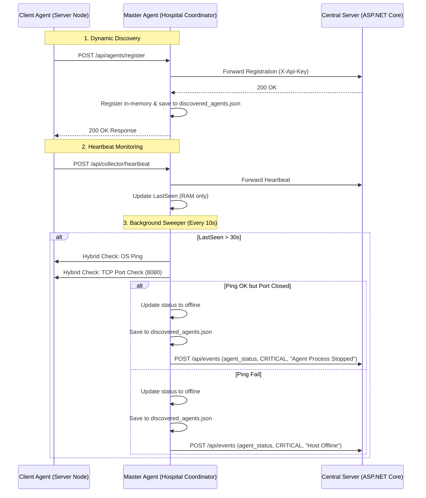

# OneSecurity - Master Agent Management & Hybrid Offline Monitoring - Design Spec

**Date:** 2026-07-08  
**Status:** Approved  
**Author:** Technical Lead & Architect  

---

## 1. Goal Description

This specification defines the extension of the **OneSecurity Go Agent** in **Master Mode** to serve as a local hospital coordinator. The Master Agent dynamically discovers local client agents, persists their registry locally, and performs active hybrid checks (ICMP Ping + TCP Port Check) when heartbeats are delayed to diagnose the exact offline cause (network failure vs. agent process crash) and report it to the Central Server.

---

## 2. Architecture & Design Details



---

## 3. Detailed Component Designs

### 3.1 Data Structures & Local Storage (`discovered_agents.json`)

Discovered clients are stored in `discovered_agents.json` in the Master Agent's workspace root.

#### Go Struct definition:
```go
type DiscoveredAgent struct {
    AgentId      string    `json:"agentId"`
    Hostname     string    `json:"hostname"`
    IpAddress    string    `json:"ipAddress"`
    Port         int       `json:"port"`         // Port of the Mock HIS Portal (defaults to 8080)
    HospitalCode string    `json:"hospitalCode"`
    Status       string    `json:"status"`       // "online" / "offline"
    LastSeen     time.Time `json:"-"`            // Kept in-memory only to avoid SSD wear
}
```

#### Storage Policies:
- **Load on Startup:** The Master Agent reads `discovered_agents.json` when starting in `master` mode to initialize the local registry.
- **Write on Event:** To minimize disk writes, the JSON file is rewritten only when:
  1. A new client registers for the first time.
  2. A client's status transitions (e.g. `online` $\leftrightarrow$ `offline`).
- **RAM Registry:** A `map[string]*DiscoveredAgent` protected by `sync.RWMutex` handles concurrent reads and updates.

---

### 3.2 Dynamic Discovery & Heartbeat Collector

#### Register Endpoint Forwarding:
1. Client sends `POST /api/agents/register`.
2. Master forwards it to Central Server `/api/agents/register` with the API Key.
3. If Central returns `200 OK`:
   - Master parses the Client IP from request body or `r.RemoteAddr`.
   - Master registers the client in memory (defaulting port to `8080`).
   - Master rewrites `discovered_agents.json`.

#### Heartbeat Forwarding & Sweeper Update:
1. Client sends `POST /api/collector/heartbeat?agentId=...`
2. Master forwards to Central Server `/api/agents/{agentId}/heartbeat`.
3. Master updates `discoveredAgents[agentId].LastSeen = time.Now()`.
4. If `agentId` is missing from registry (e.g., Master restarted):
   - Dynamically discover the agent, add to registry as `online`, and rewrite `discovered_agents.json`.
5. If `agentId` was marked `offline`:
   - Change status to `online`.
   - Rewrite `discovered_agents.json`.
   - Send recovery Event to Central Server: Category=`"agent_status"`, Severity=`"info"`, Title=`"Agent Online"`.

---

### 3.3 Active Sweeper & Hybrid Check (Ping + TCP Port Check)

A background goroutine runs every 10 seconds.

#### Sweeper Logic:
- For each agent in registry:
  - If `LastSeen` is older than 30 seconds and `Status == "online"`:
    - Perform **Hybrid Check**.

#### Hybrid Check Implementation:
- **ICMP Ping:** Execute OS command `ping -n 1 -w 1000 [IP]` (Windows) or `ping -c 1 -W 1 [IP]` (Linux). This bypasses the need for Go socket raw Admin privileges.
- **TCP Port Check:** Attempt a TCP connection with a 2-second timeout using `net.DialTimeout("tcp", "[IP]:[Port]", 2*time.Second)`.

#### Diagnosis Matrix:
| OS Ping | TCP Port Check | Diagnosis | Event Reported to Central |
|---------|----------------|-----------|---------------------------|
| **Success** | **Fail** | Host is up, but Agent process crashed | Category: `agent_status`, Severity: `critical`, Title: `"Agent Process Stopped"`, Details: `"Ping OK, TCP Port [Port] Closed"` |
| **Fail** | **Fail** | Host is down or network disconnect | Category: `agent_status`, Severity: `critical`, Title: `"Host Offline"`, Details: `"Ping Failed, TCP Port [Port] Closed"` |

---

### 3.4 Central Server Integration (`RulesEngine.cs`)

We extend the C# rules engine to parse `"agent_status"` category events and trigger critical alerts.

#### Addition to `RulesEngine.cs`:
```csharp
private async Task CheckAgentStatusRuleAsync(SecurityEvent ev)
{
    if (ev.Category != "agent_status") return;

    string serverName = ev.Server?.Hostname ?? "Server";
    await TriggerAlertAsync(
        ev,
        "Agent offline", // Triggers standard "Agent offline" rule behavior
        ev.Severity.ToUpper(), // "CRITICAL" / "INFO"
        ev.Title,
        ev.Details
    );
}
```

---

## 4. Verification Plan

### Automated Tests (`agent/main_test.go`)
- **`TestLoadAndSaveDiscoveredAgents`:** Verifies saving/loading from `discovered_agents.json`.
- **`TestSweeperOfflineDetection`:** Mocks ping/port check results to verify status changes and event reporting.

### Manual Verification
1. Run `run_all.bat`.
2. Stop the Client Agent process (`onesecurity-agent.exe` in client mode) but keep its hosting machine running.
3. Verify Master Agent reports `Agent Process Stopped` on the Dashboard and sends a Telegram alert.
4. Shut down the client network interface/machine.
5. Verify Master Agent reports `Host Offline` on the Dashboard and sends a Telegram alert.
